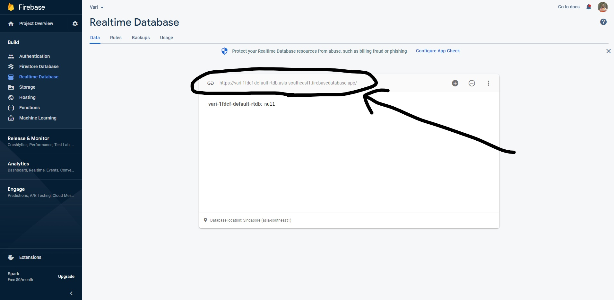

# What is PyVariable?
<b>Basically this module is for saving variables outside your code so that you don't lose their value.</b>  
Let's say you've created a game with pygame. There is a high score system and you want to save the highest score in an online database so that users all over the world can see the highest score. Here comes the usage of <b>PyVariable</b>. Yes you can also do it without <b>PyVariable</b>, but you've to write more to do so.  
Again, let's say you don't want a variable to be reset everytime you run your code, here you must use <b>PyVariable</b>. Using <b>PyVariable</b>, you can save a variable in your drive (offline) or in an online database. It's really simple enough.

   

# Installation
Installing the module is quite easy ;)  
Simple open your terminal and enter <code> pip install pyvariable</code>.  
<b><i>Note: If you face any error like <code> ModuleNotFoundError: No module named 'Crypto'</code>, then follow these steps - </i></b> 
<i>Step 1:</i> &nbsp; Open your terminal.  
<i>Step 2:</i> &nbsp; Enter <code> pip uninstall crypto</code>.  
<i>Step 3:</i> &nbsp; Enter <code> pip uninstall pycryptodome</code>.  
<i>Step 4:</i> &nbsp; Enter <code> pip install pycryptodome</code>.

    

# Variable in Folder
Import the module and create an object of the class <code> LocalVariable</code>. Call the <code> save()</code> method with the name and the value of a variable as argument to store your data locally and call any of the methods from the list below to read the value.  
<ul>
      <li><code> read_int (var_name) </code></li>
      <li><code> read_float (var_name) </code></li>
      <li><code> read_str (var_name) </code></li>
      <li><code> read_bool (var_name) </code></li>
      <li><code> read_list (var_name) </code></li>
      <li><code> read_tuple (var_name) </code></li>
      <li><code> read_set (var_name) </code></li>
      <li><code> read_dict (var_name) </code></li>
</ul>
Also, call <code> exists()</code> method with name of a variable as argument to check if the variable exists.   <b><i>Note: It will return True or False.</i></b> 
  
Here is a sample code -
<pre>
import pyvariable
data = pyvariable.LocalVariable()
data.save("Name", "John")  # This will store the variable Name with the value John
LocalName = data.read_str("Name")  # This will read the value of Name from files and store in LocalName
print(LocalName)  # This will print John
</pre>
Another example of checking if a variable exists -
<pre>
import pyvariable
data = pyvariable.LocalVariable()
if data.exists("X"):  # The method returns true if the variable exists in your folder
      print("The variable X exists")
else:
      print("The variable X doesn't exist")
</pre>

    

# Variable in online database
<h3>Setting up your database:</h3>
<i>Step 1</i>: &nbsp; Go to https://console.firebase.google.com/  
<i>Step 2</i>: &nbsp; Login with your google account.  
<i>Step 3</i>: &nbsp; Click on <b>Add Project</b> 
<i>Step 4</i>: &nbsp; Enter any name (The name doesn't matter at all).  
<i>Step 5</i>: &nbsp; Disable <b>Google Analytics</b> and click on continue.  
<i>Step 6</i>: &nbsp; After the the database creation is finished, click on continue and you'll see a window like this.  
<i>Step 7</i>: &nbsp; Click on <b>Realtime Database</b> on the left.  
<i>Step 8</i>: &nbsp; Click on <b>Create Database</b> and select your nearest location.  
<i>Step 9</i>: &nbsp; After clicking <b>Next</b>, Select <b>Start in test mode</b> and click on <b>Enable</b>  
<i>Step 10</i>: &nbsp; Go to <b> Rules</b> tab and replace the code by this -  
<pre>
{
  "rules": {
    ".read": "True",
    ".write": "True",
  }
}
</pre>
<i>Step 11</i>: &nbsp; Finally, come back to <b>Data</b> tab and just copy this url shown in the image.  

<i>Step12</i>: &nbsp; Now go to your code and import the module <b>Variables</b>. 
<i>Step13</i>: &nbsp; After that create an object of the class <code> CloudVariable</code> with the url you copied as argument.   

Everything is now ready. Simply call the <code> save()</code> method with the name and the value of a variable as argument to store your data online and call the <code> read()</code> method with the name of your variable as argument to read the value of it.   <b><i>Note: The returned value will automatically be in your desired data type.</i></b>
Also, call <code> exists()</code> method with name of a variable as argument to check if the variable exists.<i> Note: It will return True or False.</i> 
   
Here is a sample code -
<pre>
import pyvariable
data = pyvariable.CloudVariable(The_Url_You_Copied)
data.save("Name", "John")  # This will store the variable Name with the value John
LocalName = data.read("Name")  # This will read the value of Name from your database and store in LocalName
print(LocalName)  # This will print John
</pre>
Another example of checking if a variable exists -
<pre>
import pyvariable
data = pyvariable.CloudVariable(The_Url_You_Copied)
if data.exists("X"):  # The method returns true if the variable exists in your database
      print("The variable X exists")
else:
      print("The variable X doesn't exist")
</pre>
<b><i>Note: You have to use multiple firebase database (Not account) for multiple projects, simply follow from step 3</i></b>

    

# Some example usage
Example 1.1 (Count how many times a code is run) - Saving in your drive:
<pre>
import pyvariable  # Importing the module

count = 0
data = pyvariable.LocalVariable()  # Create the object
if not data.exists("count"):  # Create a variable if it doesn't exist
    data.save("count", 0)
count = data.read_int("count")  # This will read the value of count and store in count variable
count = count + 1
data.save("count", count)  # This will store the variable count with the value John
print("This program ran " + str(count) + " times")

</pre>
 

Example 1.2 (Count how many times a code is run) - Saving in online database:
<pre>
import pyvariable  # Importing the module

count = 0
data = pyvariable.CloudVariable(the_url_you_copied)  # Create the object
if not data.exists("count"):  # Create a variable if it doesn't exist
    data.save("count", 0)
count = data.read("count")  # This will read the value of count and store in count variable
count = count + 1
data.save("count", count)  # This will store the variable count with the value John
print("This program ran " + str(count) + " times")

</pre>

    

# Lisence
This module is completely free and open source. You can freely use and modify the module if you want. Any suggestion will be highly appreciated ;)  
Created by <b> Sajedur Rahman Fiad </b>  
Email : <code> neural.gen.official@gmail.com</code>  
<i> Let me know your valuable feedback. </i>
